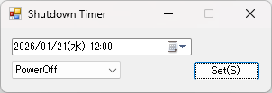

# Shutdown Timer

シャットダウンをスケジュールして自動実行します。

# 動作環境

- Windows 10, 11 (x64 / x86)
- .NET Framework 4.8

# 使い方

1. shutdowntimer.exe を実行します。
1. 左上の日時ピッカーから、実行する日時を指定します。
1. 左下のコンボボックスから、実行する処理を選択します。
   - **PowerOff** : コンピュータの電源をオフにします。
   - **Reboot** : コンピュータを再起動します。
   - **Logoff** : Windows からログオフします。
   - **Hibernate** : Windows を休止状態にします。
   - **StandBy** : Windows をスリープ状態にします。
1. 右下の Set ボタンをクリックすると、処理をスケジュールします。
1. スケジュールされた時間になると、ウィンドウが最大化し  
   "This Operating System will be shutdown at \*\* seconds later."  
   と表示され、10 秒間、カウントダウンを行います。
   - この状態の時に Cancel ボタンをクリックすると、処理を中断します。
1. カウントダウンが終了すると、3. で選択された処理が実行されます。
